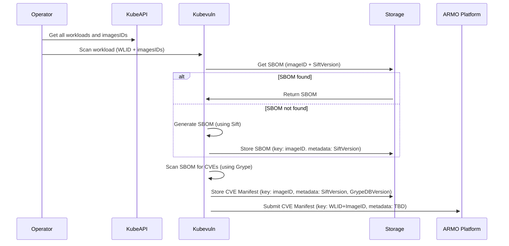
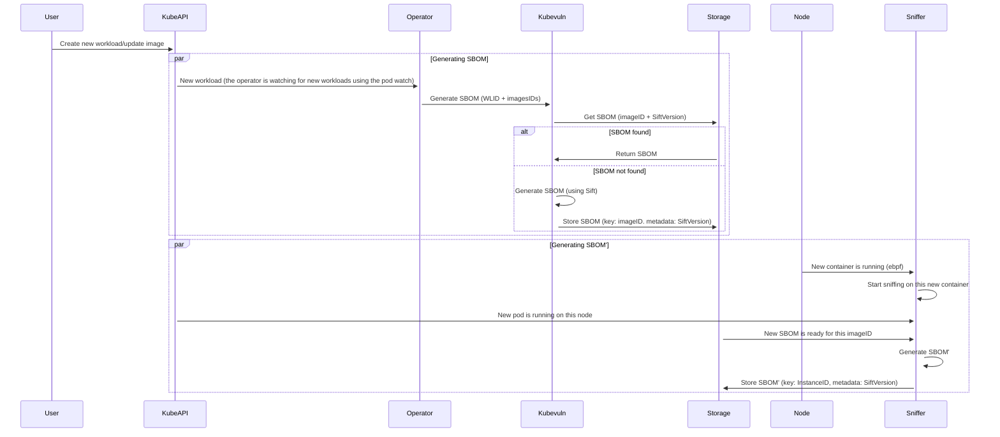
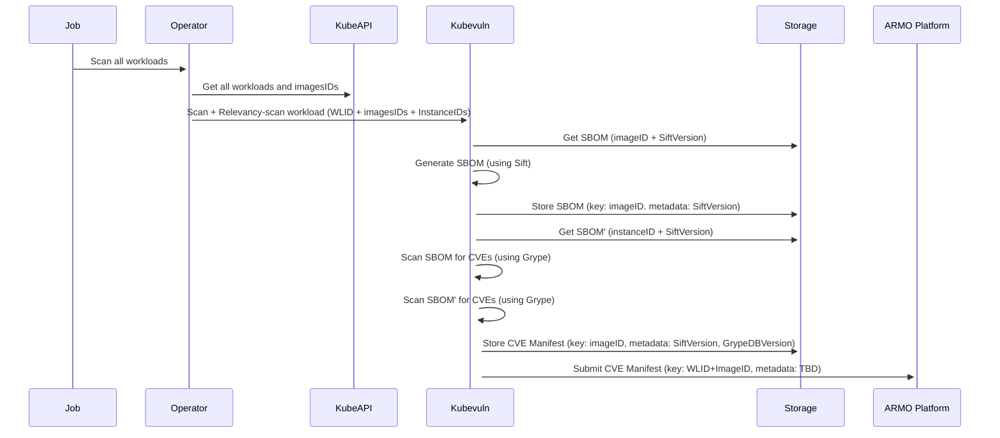
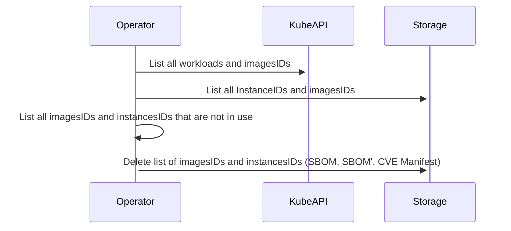

## On installation
A user is running the operator for the first time.

## New Image
A user is creating a new workload with a new image or the user is updating his existing workload with a new image.

## Recurring scan

The user pre-set a recurring scan for his cluster.

## Clear cache

One every X hours, the operator will clear the cache.

